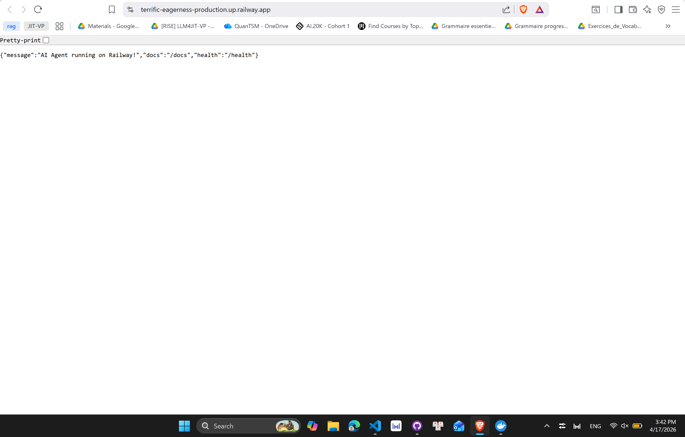
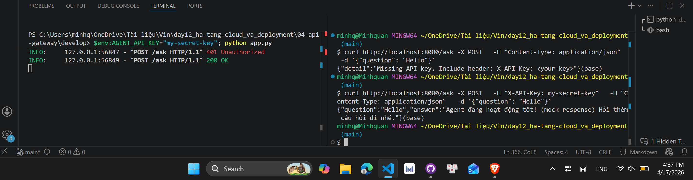
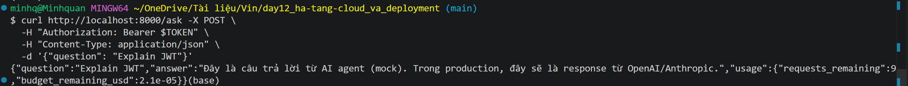
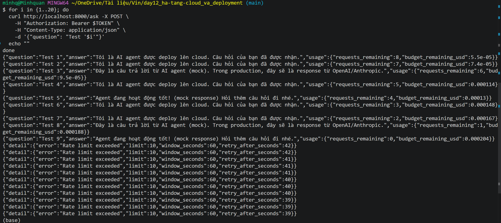

# Day 12 Lab - Mission Answers

> **Student Name:** Trần Sỹ Minh Quân
> **Student ID:** 2A202600308
> **Date:** 17/4/2026

## Part 1: Localhost vs Production

### Exercise 1.1: Anti-patterns found
1. Secrets are hardcoded in source code, like the API key and database URL.
2. Configuration is hardcoded instead of using environment variables.
3. Debug mode is enabled by default.
4. The app logs sensitive information (the API key) through print statements.
5. There is no health check endpoint, so platforms cannot reliably detect unhealthy instances.
6. The server binds to localhost only, so it is not reachable.

### Exercise 1.3: Comparison table
| Feature | Develop | Production | Why Important? |
|---------|---------|------------|----------------|
| Config | Hardcoded secrets, port, and debug settings in code | Centralized environment-based settings | Prevents secret leaks and makes configuration portable across dev, staging, and production |
| Health check | No dedicated health/readiness endpoints | Includes liveness and readiness endpoints | Lets orchestrators and load balancers know when to restart or route traffic |
| Logging | Print-based logs, including potential sensitive data | Structured JSON logging with logging module | Improves observability, searchability, and integration with log platforms |
| Shutdown | Abrupt termination behavior | Graceful shutdown using lifespan and SIGTERM handling | Reduces dropped requests and supports safer deploy/scale events |

## Part 2: Docker

### Exercise 2.1: Dockerfile questions
1. Base image: `python:3.11`.
2. Working directory: `/app`.
3. Why COPY requirements first: to leverage Docker layer cache. If only app code changes but dependencies stay the same, Docker reuses the cached `pip install` layer and rebuilds much faster.
4. CMD vs ENTRYPOINT: `CMD` provides the default command and can be overridden easily at runtime, while `ENTRYPOINT` defines the main executable of the container. In the Dockerfile, `CMD ["python", "app.py"]` sets the default startup command.

### Exercise 2.3: Image size comparison
- Develop: 1699.84 MB
- Production: 236 MB 
- Difference: 86.1%

## Part 3: Cloud Deployment 

### Exercise 3.1: Railway deployment
- URL: https://terrific-eagerness-production.up.railway.app/
- Screenshot: 

## Part 4: API Security

### Exercise 4.1-4.3: Test results

#### Exercise 4.1 test result

#### Exercise 4.2 test result

#### Exercise 4.3 test result

### Exercise 4.4: Cost guard implementation
I implemented a monthly Redis-based budget guard with these rules:

1. Budget policy:
- Per user monthly budget is $10 (configurable via `MONTHLY_BUDGET_USD`, default `10`).
- Budget is tracked by month key format `budget:{user_id}:{YYYY-MM}`.

2. Core function contract:
- `check_budget(user_id, estimated_cost) -> bool`
- Returns `True` when `current_spending + estimated_cost <= monthly_budget`.
- Returns `False` when the request would exceed budget.

3. Redis accounting:
- Read current spending using `GET budget:{user_id}:{YYYY-MM}`.
- After request completes, add real cost via `INCRBYFLOAT`.
- Set TTL (`EXPIRE 32 days`) so old month keys are auto-cleaned.

4. API integration:
- In `/ask`, estimate request cost before LLM call.
- If `check_budget(...)` is `False`, return HTTP `402 Payment Required`.
- If allowed, process request then record real token usage and cost.

5. Local reliability:
- If Redis is unavailable, code falls back to in-memory spending map so demo still runs.
- In production deployment, Redis should be enabled to keep budget state across instances.

## Part 5: Scaling and Reliability

### Exercise 5.1-5.5: Implementation notes
#### Exercise 5.1: Health checks (`/health`, `/ready`)
Implemented in `05-scaling-reliability/develop/app.py`:
- `/health` (liveness): returns uptime, environment, timestamp, and dependency checks.
- `/ready` (readiness): returns 503 when service is not ready; returns in-flight request info when ready.

Test results (PowerShell):
- `GET /health` returned `200` with `status: ok`.
- `GET /ready` returned `200` with `ready: true`.

#### Exercise 5.2: Graceful shutdown
Implemented using:
- `lifespan()` shutdown phase to mark service not ready and wait for in-flight requests.
- Signal handlers for `SIGTERM`/`SIGINT` to log and allow graceful termination.

Validation:
- During `docker compose down`, all agent instances logged shutdown lifecycle:
	`Shutting down` → `Waiting for application shutdown` → `Application shutdown complete`.
- Containers exited with code `0`.

#### Exercise 5.3: Stateless design
Implemented in `05-scaling-reliability/production/app.py`:
- Session/conversation history is stored in Redis (`session:{session_id}`), not process memory.
- Added helper functions: `save_session`, `load_session`, `append_to_history`.
- `session_id` is reused across turns so any instance can continue the same conversation.

#### Exercise 5.4: Load balancing with Nginx
Implemented and fixed in production stack:
- `docker-compose.yml`: Redis + Nginx + scalable `agent` service.
- `nginx.conf`: upstream `agent:8000` with round-robin.
- Added missing production Docker assets:
	- `05-scaling-reliability/production/Dockerfile`
	- `05-scaling-reliability/production/requirements.txt`

Test command used:
- `docker compose up --build --scale agent=3`

Observed:
- 3 agent instances started successfully.
- Requests were distributed across multiple instances.

#### Exercise 5.5: Stateless verification script
Ran `python test_stateless.py` against Nginx endpoint.

Observed output:
- 5 consecutive chat requests served by 3 different instances.
- Same `session_id` preserved.
- History endpoint returned `10` messages (5 user + 5 assistant), proving cross-instance continuity via Redis.

Conclusion:
- Part 5 requirements (health/readiness, graceful shutdown, stateless storage, load balancing, stateless test) are implemented and validated.
